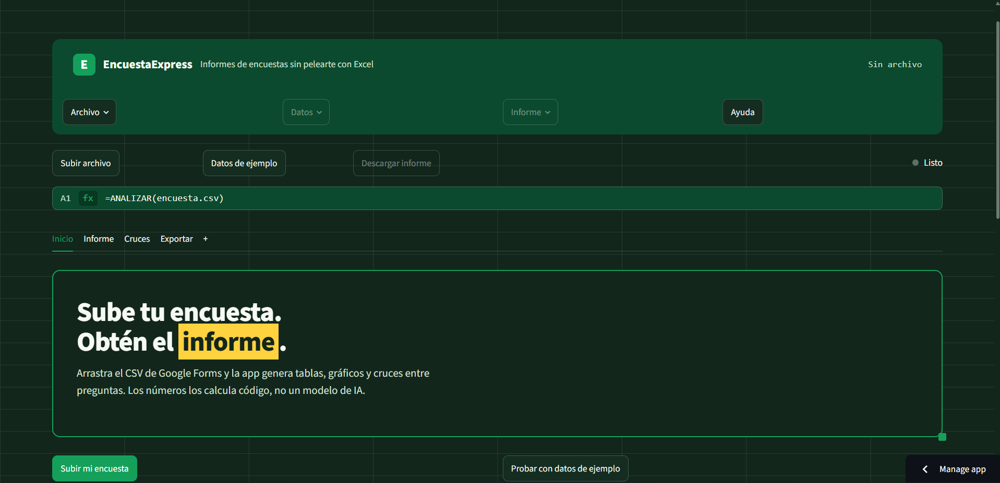
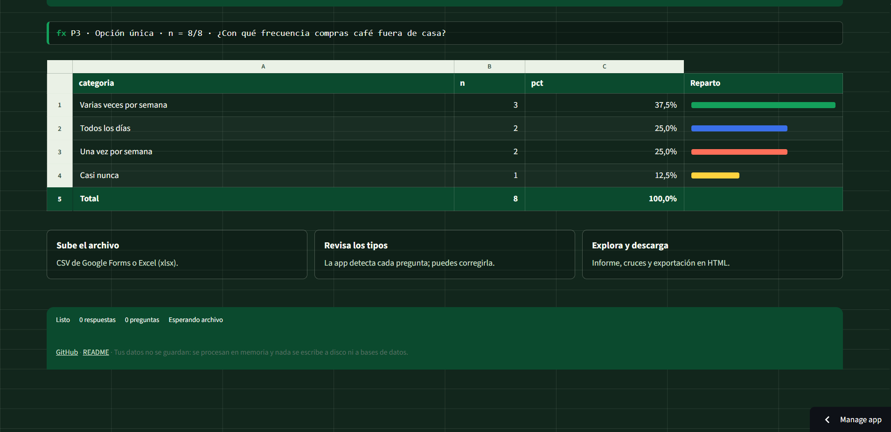

# EncuestaExpress

**Problema que resuelve:** quien hace una encuesta pequeña en Google Forms tarda horas en pasar el CSV a tablas y gráficos presentables en Excel, con errores típicos en multirrespuesta y sin documentar los sin-respuesta. EncuestaExpress convierte ese CSV (o .xlsx) en un informe automático en minutos.

Sube tu archivo y obtén: perfil de la muestra, tabla + gráfico por pregunta según su tipo, cruces entre dos preguntas (con chi-cuadrado cuando aplica), filtro por segmento y descargas en HTML, PDF y CSV.

Cálculos deterministas con pandas/scipy. Sin LLM para calcular. Despliegue en Streamlit Community Cloud; local como plan B.

> URL Cloud: [https://encuesta-express.streamlit.app](https://encuesta-express-yy5y7bsea6qyaejzvpbtge.streamlit.app/)
## Funcionalidades
- Carga CSV (UTF-8 o latin-1; coma, punto y coma, tab o `|`, detectados) y .xlsx (primera hoja) + vista previa y n total; tope 5 MB / 50.000 filas.
- Autodetección de tipos (timestamp, escala 1-5, única, múltiple, texto, email) con corrección manual e ignorado de columnas.
- Por pregunta: única → tabla n/% + barras H; múltiple → % sobre respondientes + barras H; escala → media/mediana/DT + barras V; texto → listado paginado.
- Cruces: cat×cat (% fila/columna, apiladas/agrupadas), escala×cat (medias), múltiple×cat (descriptivo); aviso si grupo <5; chi-cuadrado con V de Cramér e interpretación en llano solo cuando las esperadas lo permiten.
- Filtro por segmento aplicado a todo el informe.
- Exporta informe HTML autónomo (abre offline), PDF con gráficos, CSV por tabla y Excel con todas las tablas.

## Stack
- Python 3.10+, Streamlit==1.64.0, pandas==3.0.6, Plotly==7.1.0, openpyxl==3.1.5, fpdf2==2.8.9, scipy==1.18.1, pytest==9.1.1 (todo fijado en `requirements.txt`).

## Capturas



## Ejecutar en local (plan B para la demo)
```powershell
pip install -r requirements.txt
streamlit run app.py
python -m pytest -q
```
Demo con `data/ejemplo_encuesta.csv` (o `tests/fixtures/ejemplo_encuesta.xlsx`).

## Desplegar en Cloud
Ver `docs/DESPLIEGUE.md`. Tras desplegar, pega la URL arriba.

## Estructura
- `app.py` — UI Streamlit (sin cálculos)
- `src/analysis.py` — lógica pandas pura (carga, tipos, frecuencias, cruces, filtro)
- `src/chi2.py` — chi-cuadrado con condiciones de aplicación
- `src/plots.py` — figuras Plotly (sin streamlit dentro)
- `src/export_html.py`, `src/export_pdf.py` — informes descargables
- `fonts/` — DejaVuSans.ttf para el PDF (ver `fonts/LICENCIA-FUENTE.txt`)
- `tests/` (+ `tests/fixtures/`) — tests deterministas
- `data/ejemplo_encuesta.csv` — demo café, 8 filas anonimizadas
- `docs/` — PROBLEMA, ALCANCE, BACKLOG, DESPLIEGUE

## Docs
- `docs/PROBLEMA.md`, `docs/ALCANCE.md` (incluye supuestos S1–S16), `docs/BACKLOG.md`

Estado: Must + Should completos (27 tests en verde); app desplegada en Cloud (URL arriba); demo local con datos de ejemplo.
